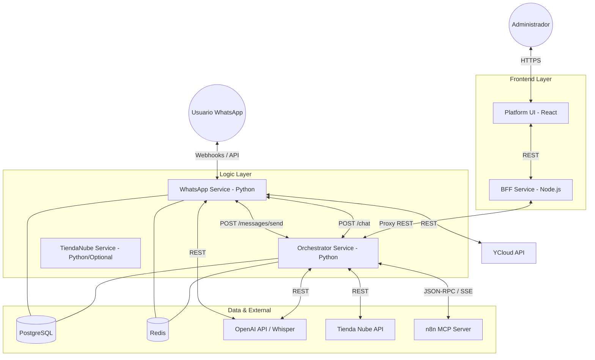

# Arquitectura de Comunicación de Servicios - Pointe Coach Agent

Este documento detalla cómo interactúan los diferentes microservicios del proyecto, los protocolos utilizados y el flujo de datos principal.

## Diagrama de Comunicación General

## Flujos de Datos Principales

### 1. Mensaje Entrante (WhatsApp -> Respuesta AI)
1. **YCloud** envía un webhook a `whatsapp_service` (`/webhook/ycloud`).
2. `whatsapp_service` valida la firma HMAC y extrae el mensaje.
    - Si es **audio**, lo envía a **OpenAI Whisper** para transcripción.
3. El mensaje se envía a `orchestrator_service` (`POST /chat`).
4. `orchestrator_service` identifica al **Tenant** (tienda) buscando el número de destino en la DB.
5. El **Agente LangChain** procesa el mensaje:
    - Consulta el historial en **Redis**.
    - Utiliza herramientas (Tools) para consultar **Tienda Nube** o llamar a **n8n**.
    - Genera una respuesta usando **GPT-4o-mini**.
6. La respuesta estructurada vuelve a `whatsapp_service`.
7. `whatsapp_service` envía el mensaje final al usuario vía **YCloud API**.

### 2. Panel de Administración
1. El `platform_ui` realiza peticiones al `bff_service`.
2. El `bff_service` actúa como un proxy transparente hacia el `orchestrator_service`.
3. El `orchestrator_service` gestiona la configuración de tenants, credenciales y visualización de logs históricos desde la DB.

### 3. Herramientas Externas (Tools)
- **Tienda Nube**: El orquestador integra directamente llamadas REST a la API oficial para buscar productos y órdenes.
- **n8n (MCP)**: Utilizado para operaciones complejas como listar cupones de descuento o enviar correos de soporte, funcionando sobre el protocolo MCP (Model Context Protocol).

## Protocolos y Puertos

| Servicio | Puerto Interno | Puerto Externo | Descripción |
| :--- | :--- | :--- | :--- |
| `bff_service` | 3000 | 3000 | Proxy para el frontend. |
| `orchestrator_service` | 8000 | 8000 | Cerebro de la IA y API Admin. |
| `whatsapp_service` | 8002 | 8002 | Maneja webhooks y envío de mensajes. |
| `tiendanube_service` | 8001 | 8001 | (Opcional) Herramientas simplificadas de TN. |
| `postgres` | 5432 | 5432 | Base de datos principal. |
| `redis` | 6379 | 6379 | Cache y memoria de corto plazo. |

## Seguridad Interna
- Las comunicaciones entre servicios (ej: `WA` -> `ORCH`) están protegidas por un `INTERNAL_API_TOKEN`.
- El acceso al panel administrativo requiere un `ADMIN_TOKEN`.
- Las credenciales sensibles (API Keys) se guardan encriptadas en la base de datos (PostgreSQL).
